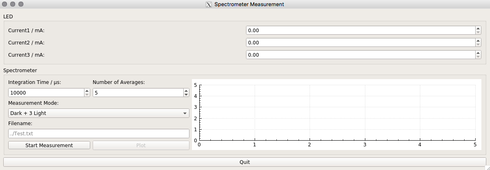
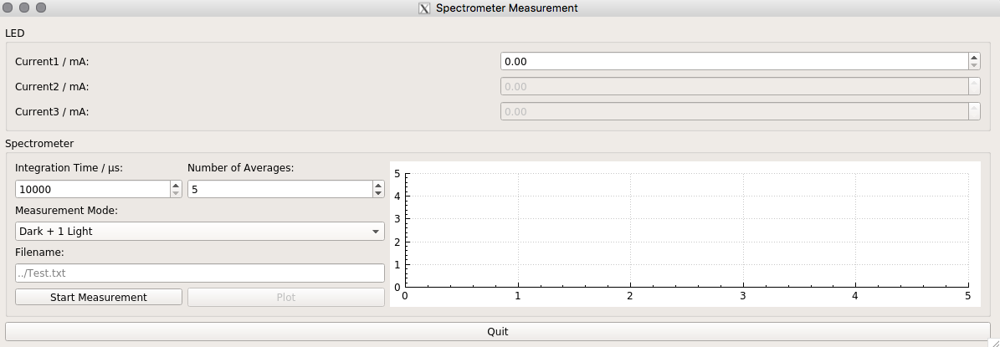

# Control the Hamamatsu MiniSpectrometer
 Author: Janine Müller

 based on Code of https://sourceforge.net/p/usbspecdrivers/code/ci/master/tree/Hamamatsu/python/HamamatsuMiniSpectrometer.py

## Description
This Software controls a Hamamatsu MiniSpectrometer connected to the PC via USB and controled with C++.
It is used to do measurements with scintillating fibres or mats built from scintillating fibres.
A current source operated via RS232 allows to pilot UV-LEDs to excite the fibre(s).  

The repository contains the source code as well as CMakeLists and a GUI version to operate such system.

## Requirements to run terminal program

Availability of the following libraries (author: Janine Müller):
* [LEDClass][1]
* [RSS232Communication][4]

Driver of Hamamatsu Spectrometer:
needs to be rebuilt everytime kernel is being updated
* https://sourceforge.net/p/usbspecdrivers/wiki/Installation/
* edit `usbhspec.c` such as (2 times):

```bash
//static DEVICE_ATTR(gain, S_IWUGO | S_IRUGO, show_gain, set_gain);
static DEVICE_ATTR(gain, 0660, show_gain, set_gain);
```
* make sure, that your user is in group `plugdev`

RS232 Currentsource:
* Make sure that your user is in group `dialout`

## Additional requirements to run GUI

Install QT5:
* QT5 uses different number format 
* add to your `.bashrc`:

```bash
export CMAKE_PREFIX_PATH=/usr/local/Qt-5.8.0/
export LC_NUMERIC=en_US.UTF-8
```

## How to run the control

### Terminal progamm

1.) Compile source code:

```bash
mkdir build
cd build
cmake ..
make
```

2.) Execute it:

```bash
./bin/SpectrometerMain
```

3.) Follow instructions written in terminal.


### GUI

0.) Go to GUI folder

```bash
cd Spectrometer_gui
```

1.) Compile source code:

```bash
mkdir build
cd build
cmake ..
make
```

2.) Execute it:

```bash
./bin/SpectrometerGUI
```

3.) A window is opening to control the Spectrometer measurement.
It is possible to choose between various `Measurement Modes`

4.) Single Measurement:
Usually used to determine the current for a "real" meaurement
* Choose a `Integration Time` of the Spectrometer
* Choose the `Number of Averages` which per measurement will taken
* Select the Spectrometer Mode `Single`
* Choose a current for the LED
* Hit the `Start Measurement` button to start actually the measurement
* Afterwards the `Plot` button will be enabled to display the spectrum in the plot region

5.) Dark + 1 Light Measurement:
At each position take a darkcount and a light measurement with the given current.
* Choose the Spectrometer Measurement Mode `Dark + 1 Light`
* If wanted: Specify path and name for the saved file
	* if not specified it will be saved at `~/data/Spectrometer/TestSpectrum.txt`
* Choose a current for the LED
* Hit the `Start Measurement` button to start actually the measurement



6.) Dark + 3 Light Measurement:
At each position take a darkcount and three light measurements with the given currents.
* Choose the Spectrometer Measurement Mode `Dark + 1 Light`
* If wanted: Specify path and name for the saved file
	* if not specified it will be saved at `~/data/Spectrometer/TestSpectrum.txt`
* Choose a current for the LED
* Hit the `Start Measurement` button to start actually the measurement




[1]: https://git.e5.physik.tu-dortmund.de/jmueller/LEDClass
[4]: https://git.e5.physik.tu-dortmund.de/jmueller/RS232communication